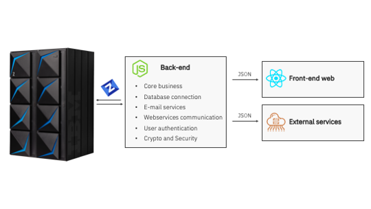
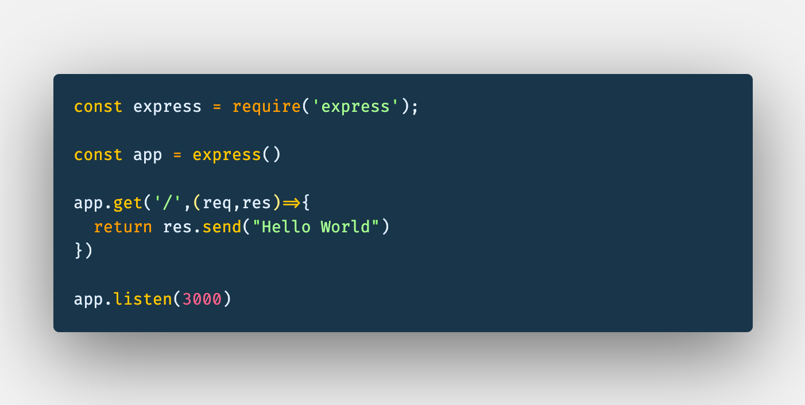
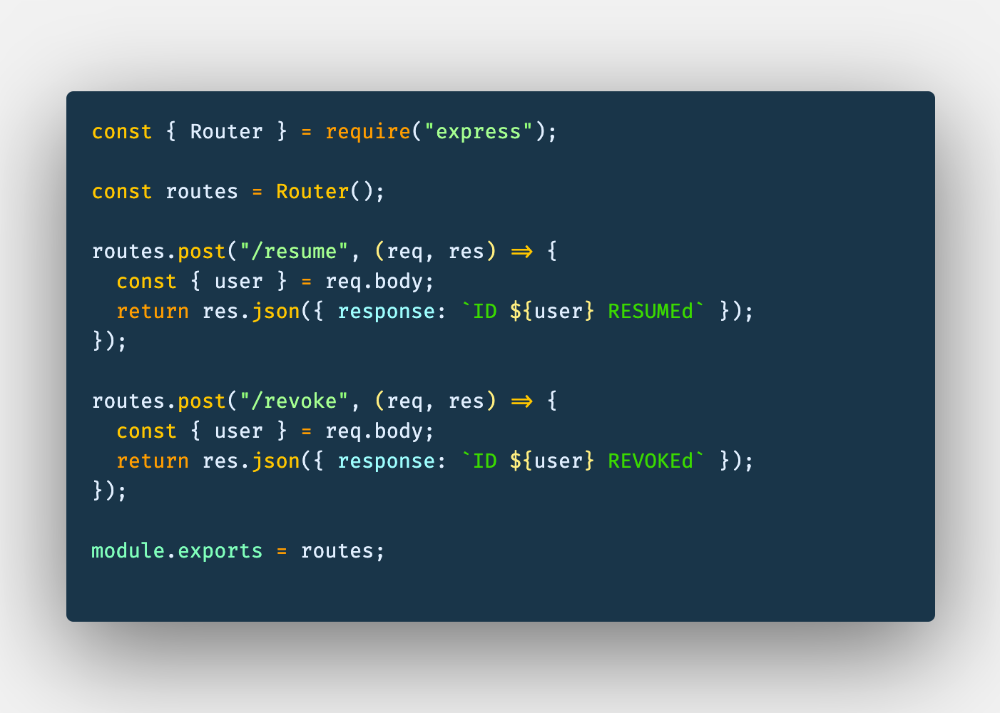
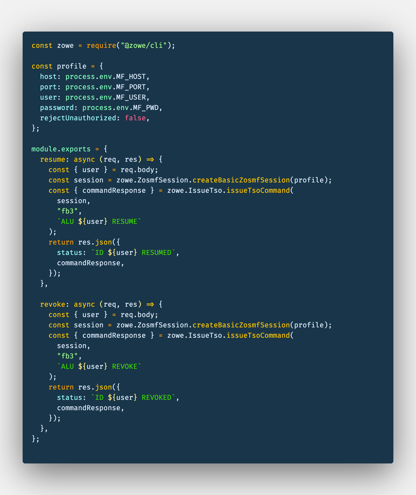
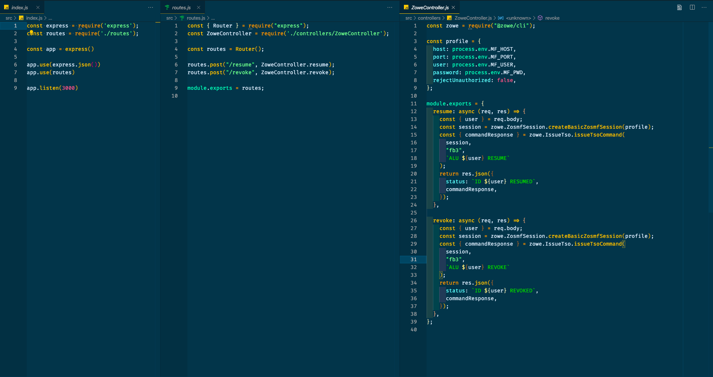

# Creating an API to resume and revoke RACF IDs on z/OS

## Introduction

There is an misunderstood that zOS environments need to be something isolated on the infrastructure, but on lsat years we've seen an increase of open source being used on cloud development, that allow us to integrate and deliver new features faster than ever and all this ecosystem is also available to use on and with zOS environments.

There is an specific open source project from Open Mainframe Project, Zowe, that is evolving really fast and allow us to easily access apis available on our environment making use of all other skills availble for any cloud platform.

Here we are going to see how to create a NodeJS application that exploits one of the Zowe components to create an api that can be hosted in any cloud environment to resume and revoke user ids on the zOS, and could be integrated with a web or mobile application, or even with a chat bot!

<div align="center"></div>

## Prerequisites

- NodeJS installed
- VSCode or any other IDE/Text editor

This tutorial will guide you to use NodeJS modules availble to create an API starting from a Hello World web server till integrate with Zowe to communicate with your environment.

## Estimated time

You should be able to finish this tutorial in about 30 - 45 minutes, depending on your familiarity with app development.

<div align="center"></div>

## Steps

Here are the steps required to complete this tutorial. All the code provided below can also be found here.

1. Creating the NodeJs Project
2. Installing node modules
3. Creating our Hello World
4. Adding our routes
5. Integrating with Zowe

### 1. Creating the NodeJS Project

To initialize our project on the folder we are creating the Node app we are going to use the following command:

```
npm init --yes
```

or

```
yarn init -y
```

It should create a JSON file called `package.json` that we use to describe our project. It can have information about licenses, repository, packages, scripts...

### 2. Creating the NodeJS Project

To build this API we are going to create a Express server and we are going to use the following NodeJS modules

- Express - that will help us to build this web server.
- Dotenv - We are going to use to keep info like, ip of the lpar, user id, out of our code, as it let us create locally some environment variables
- @zowe/cli - To interact with the lpar and issue the RACF commands
- nodemon - as a local dependency, to help us get more productivity as we save changes and we get our server refreshed automatically.

To install this dependencies use the following commands:

```
npm i express dotenv @zowe/cli
npm i nodemon --save-dev
```

or

```
yarn add express dotenv @zowe/cli
yarn add nodemon -D
```

Note that once you installed the dependencies a folder called node-modules was created, this is where all code related to the node modules are downloaded.

### 3. Creating our hello world

To begin i will create a folder called `src` where all our code will reside and where we will create our index.js.

```
-
|-/node-modules
|-/src
|    |- index.js
|
|-package.json

```

To use the express module we need to bring that to our code on a variable, we can give any name for that. So we are going to use `const express = require("express")`.

Now the functions of express are available to us through we are going to create an instance called app that will be our server and will be listening on local port `3000`

```
const express = require('express');

const app = express()

app.listen(3000)
```

Before we can test that we will need to add a route. To test it, let's create a simple route to our localhost where we send back a hello world message to the browser.

There are different HTTP methods that we can use, but to be able to try it on browser we need to use the `get`. The express get method will expect at least 2 parms. The `route` that is what come after the address of it, so if we just use `/` it will accept requests on `http://localhost:3000/`. And the function to execute once a request come to this route:

```
app.get('/',(req,res)=>{
  return res.send("Hello World")
})
```

This 2 variables that the function receive are the incoming request and the response. To use the Hello World we are going to only send back a string with Hello World.

<div align="center"></div>

To test it let's first update our `package.json` with our `dev` script:

```
"scripts": {
    "dev": "nodemon src"
  },
```

And then run:

```
npm run dev
```

or

```
yarn run dev
```

Now you can open your browser to see the response coming back from `http://localhost:3000/`

### 4. Adding our routes

To be more organized and do not let all code in one file, making it unreadable, lets create a file called routes.js and move our routes to this

```
-
|-/node-modules
|-/src
|    |- index.js
|    |- routes.js
|
|-package.json

```

On `routes/.js` we are goint to require only the Router module from express, and we will create a route to `resume` and one to `revoke`. They will expect to receive on the body of this request a json with the data of the user, for this rest we are going to expect only a json like this:

```
{
  "user":"IDNNNNN"
}
```

These 2 routes are being acessed through post requests, and for test we are returning a json with the message that id was resumed or revoked:

<div align="center"></div>

We can now on index.js replace the `app.get` for `app.use` to use this routes, and to be able to read json on the requests we also need to use `express.json()`.

```
const express = require('express');
const routes = require('./routes');

const app = express()

app.use(express.json())
app.use(routes)

app.listen(3000)
```

### 5. Integrating with Zowe

To host our code related to Zowe, we are going to create a folder called `controllers` and add it as `ZoweController.js` and on our root a file called `.env`to host the mainframe variables.
```
-
|-/node-modules
|-/src
|    |- index.js
|    |- routes.js
|    |- /controllers
|              |- ZoweController.js
|
|-package.json
|-.env

```
To use `.env` add `require('dotenv/config')`on the beginning of `index.js` and on .env add the following content:
```
MF_HOST=NNN.NNN.NNN.NNN
MF_PORT=NNNN
MF_USER=YOURID
MF_PWD=YOURPWD
```
On ZoweController we are going to import the @zowe/cli and create the profile we are going to use on our connections:
```
const zowe = require('@zowe/cli');
const profile = {
  host: process.env.MF_HOST,
  port: process.env.MF_PORT,
  user: process.env.MF_USER,
  password: process.env.MF_PWD,
  rejectUnauthorized: false,
}
```

And create the functions resume and revoke to export. To enable that we are going to use modules available on @zowe/cli.

A really nice feature from VSCode that it can easily integrate, mainly with typescript - and the cli is written in typescript, to facilitate our 'discovery' about what is available, look this example to create a zOSMF Session how we can easily find the way and what are expected on these functions:

<div align="center"></div>

These functions depending on external components and we need to wait the feedback from this calls before proceeding with our execution, so we are going to create `async` functions.

After we take the userid from the post request, we are going going to first create the session and then issue the command to return that the user ids were resumed/revoked.

```
async (req, res) => {
    const { user } = req.body;
    const session = zowe.ZosmfSession.createBasicZosmfSession(profile);
    const { commandResponse } = zowe.IssueTso.issueTsoCommand(
      session,
      "fb3",
      `ALU ${user} RESUME`
    );
    return res.json({
      status: `ID ${user} RESUMED`,
      commandResponse,
    });
```

<div align="center"></div>


With the controller ready we can now update our `routes.js`to require it and update our routes to use them.
```
const { Router } = require("express");
const ZoweController = require('./controllers/ZoweController');

const routes = Router();

routes.post("/resume", ZoweController.resume);
routes.post("/revoke", ZoweController.revoke);

module.exports = routes;
```

# \{ TheEND }

<div align="center"></div>